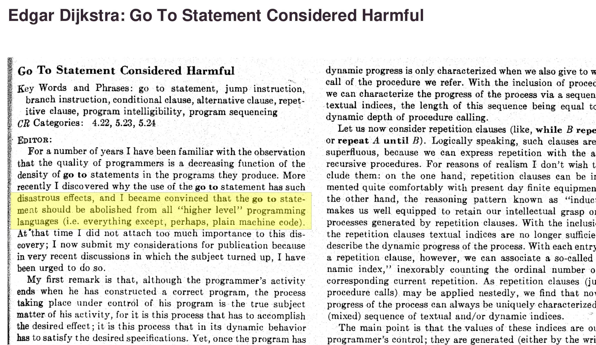
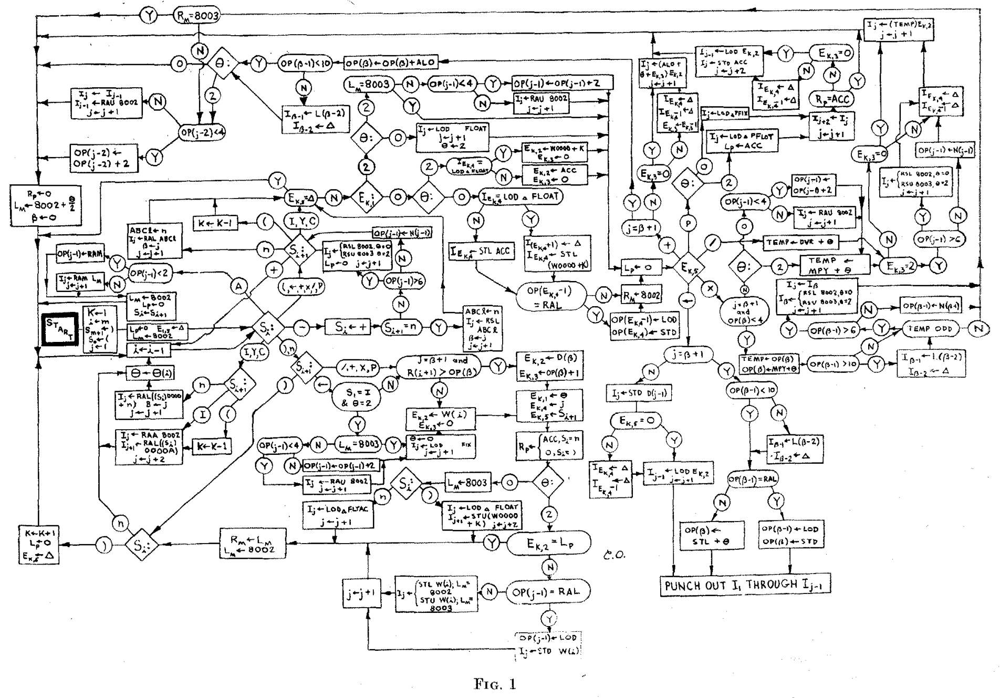
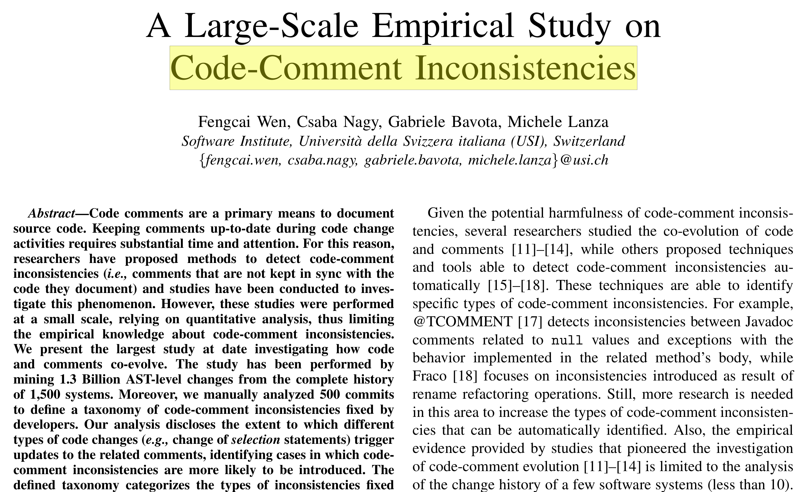

<!-- _class: title -->
# ソフトウェア設計論 <div class="logo">#11</div>
## まつ本

---
# 何の授業をしようか･･･
## SW設計の内容であること
単なる前提, ただし広い

## 被らないこと
SW設計論13回 (楠本) 要求･見積･RFP
SW開発論15回 (肥後) 要求･設計･実装･テスト

## 役立つ内容にしたい
情報科学研究科の最大公約数を
幸いSW工学･設計周りは汎用的で役に立ちやすい

## 知らなさそうな話をしたい
B3授業 (演習D･実験B) の経験から考える

---
<!-- _class: outline-->
# 開発者が知っておくべきトピック集<br><sub>－実装編－</sub>
<div class="corner-triangle"><div class="corner-triangle-text">目次</div></div>

<span class="disabled">・SWEBOK</span>
<span class="disabled">・良い名前をつける</span>
<span class="disabled">・動くの先にある良いプログラム</span>
<span class="disabled">・良いプログラムとは？</span>
<span class="disabled">・_Don't call us, we'll call you_</span>
<span class="enabledx">・goto不要論からの学び</span>
<span class="disabled">・goto不要論からの学び</span>
<span class="disabled">・できないことを増やす</span>
<span class="disabled">・分割統治</span>
<span class="disabled">・DRY･KISS･YAGNI</span>
<span class="disabled">・コメントはない方が良い</span>
<span class="disabled">・状態を減らす</span>
<span class="disabled">・bb</span>


---
# ソフトウェア工学基礎知識体系
## SWEBOK
Software Engineering Body of Knowledge
IEEEが作っているSEの知識体系

知識や概念の「体系化･構造化」が目的
例：生物分類 `脊索動物門 > 哺乳綱 > サル目 > サル科 > ...`

内容は薄くて広い
構造付きの辞書とみなすと良い


## 他にもいろいろなBOKがある
Project Management BOK
Data Management BOK
主にIT系分野

---
# SWEBOK 目次
## 全15章
```
1. SW要求
2. SW設計
3. SW構築
4. SWテスティング
5. SW保守
6. SW構成管理
7. SWエンジニアリング・マネージメント
8. SWエンジニアリングプロセス
9. SWエンジニアリングモデルおよび方法
10. SW品質
11. SWエンジニアリング専門技術者実践規律
12. SWエンジニアリング経済学
13. 計算基礎
14. 数学基礎
15. エンジニアリング基礎
```

---
# SWEBOK 目次
## SW設計の部分を抜粋
```
2. SW設計
  - SW設計の基礎
  - SW設計における主要な問題
    - 並行処理
    - イベントに対する制御と処理
    - データの永続化
    - コンポーネントの分散化
    - エラー・例外処理
    - 対話と表示
    - セキュリティ
  - SW構造とアーキテクチャ
  - UI設計
  - SW設計品質の分析と評価
  - SW設計のための表記
  - ...
```

---
# SWEBOK 目次
## 全15章
```
1. SW要求
2. SW設計
3. SW構築          // 今日はここ ★★★★
4. SWテスティング   // 次回
5. SW保守
6. SW構成管理
7. SWエンジニアリング・マネージメント
8. SWエンジニアリングプロセス
9. SWエンジニアリングモデルおよび方法
10. SW品質
11. SWエンジニアリング専門技術者実践規律
12. SWエンジニアリング経済学
13. 計算基礎
14. 数学基礎
15. エンジニアリング基礎
```

---
# 良い名前をつける
良いプログラミングの第一歩

```diff
- return result; // 抽象的すぎて何も伝わらない
+ return count;  // 具体的な名前を
```

```diff
- int delay = 1000;   // delay WHAT?+ int delayMs = 1000; // 単位をつけるべき
```

```java
if (debug) {
  String s = ..; // スコープが小さいならサボってもOK
  print(s);
}
```

```diff
- getData();     // 抽象的すぎて何も伝わらない
+ getUserId();   // 具体的な名前を
```

```diff
- getMean();     // 開発者の期待を裏切る名前
+ computeMean(); // 計算コストを要するという旨を伝える
```

---
# 良い名前をつけるには?
## 色のある動詞を考える
`get` よりも `compute` `calculate` `retrieve` `extract`

## 分離する (関数名の場合)
名前をつけられない＝やりすぎ

## 他者のソースコードを読む <sub>[git/builtin/clone.c](https://github.com/git/git/blob/master/builtin/clone.c)</sub>
```c
int cmd_clone(int argc, const char **argv, const char *prefix)
  if (argc == 0)
    usage_msg_opt(_("You must specify a repository to clone."),
	  builtin_clone_usage, builtin_clone_options);
```


```
$ git clone
fatal: You must specify a repository to clone.
usage: git clone [<options>] [--] <repo> [<dir>]
```


---
<!-- _class: outline-->
# <!--fit-->outline


---
# 動くプログラムは簡単
## プログラミング言語の基本命令
変数の宣言 `int i` `String s` `var v`
四則演算 `sum+100` `i++` `total*rate`
関数呼び出し `print("err")` `sort(arr)` `str.lower()`
繰り返し `for(..)` `while(..)`
条件分岐 `if(..)` `switch(..)`

## これだけであらゆる処理が可能
チューリング完全
意図通りに動くプログラムは作れる

動くようになったら「良い」を考えるべき

---
# プログラミングの習得レベル
## Lv1. アルゴリズムとデータ構造

## Lv2. 構文･文法
Lv1+Lv2で動くプログラムは作れる

## Lv3. パラダイム
構造化･オブジェクト指向･関数型･宣言型

パラダイムの理解には様々な概念の理解が必要
　- OO：カプセル化･継承･移譲･ポリモルフィズム
　- 関数型：参照透過性･冪等性･純粋性･副作用

Lv2は具体的で簡単, Lv3は抽象的で難しい

---
# 動くの先にある良いプログラム
## Lv3パラダイムの理解が重要
Lv2で満足してはいけない
Lv3を習得すると劇的にプログラミングが上達する

LibやFWを使う際に開発者の気持ちがわかる
暗黙の了解がいたるところにある

理論を理解すれば実践が楽になるのと同じ
理論と実践の両方に取り組むべき

## ただしLv2の段階でも様々な良さがある
適切な名前･関数分割･浅いネスト等

---
# 良いプログラムとは？
## 信頼性･効率性 <sub>(実行的側面の良さ)</sub>
目的を満たすか？バグがないか？
リソースの無駄がないか？

## 可読性･保守性
読みやすいか？意図を汲み取れるか？

## 拡張性
拡張時の作業は書き換えか？追加か？

## テスタビリティ
`main()` vs `main()+sub1()+sub2()+sub3()`

---
<!-- _class: outline-->
# <!--fit-->outline

---
# _Don't call us, we'll call you_
## 制御の反転・ハリウッド原則
制御の主となるmain()を自分で書かない
フレームワークはこの考えに基づく

普通の制御
```java
[My source] // 我々のプログラムがLibを呼び出す
  ↓ call
[Library]
```

制御の反転
```java
[Framework] // main関数はここ
  ↓ call
[My source] // 我々のプログラムはFWから呼ばれる 
  ↓ call
[Library]
```

---
# FWの利用方法
FWのルールに則ってプログラムを作る
どんな時に･何をしたいかだけを記述する (!!)
あとはFWに任す
雑多な共通処理は全部FWがやってくれる

システム全体の制御を考えなくてよい

## 
---
# 制御の反転の一例
## Flask
```py
from flask import Flask
app = Flask(__name__)

@app.route("/")
def hello_world():
  return "<p>Hello, World!</p>"
```

## Arduino言語
```c
void setup() {
  // 最初に一度だけ呼ばれる
}
void loop() {
  // 無限に何度も呼ばれる
}
```

---
# 制御の反転のpros/cons
## Pros
FWを利用する開発者はとても楽
共通の処理をFWに任せられる
関心の分離が可能

## Cons
できることに制限が生まれる
かゆいところに手が届かない

FWに対する深い理解が必要
　- いつcallback関数のか？


---
<!-- _class: outline--><!-- -------------------------------------------------------------------------------- -->
# <!--fit-->outline

---
# goto有害論

## 

<subb>E.W. Dijkstra, Communications of the ACM, 1968</subb>

---
# X Considered Harmful
<div class="corner-triangle"><div class="corner-triangle-text">雑談</div></div>

## 

---
# gotoの例
```arm
qsort:
    PUSH    {R0-R10,LR}
    MOV     R4,R0
    MOV     R5,R1
    CMP     R5,#1
    BLE     qsort_done         # goto文
    CMP     R5,#2
    BEQ     qsort_check        # goto文
    ..       
qsort_check:
    LDR     R0,[R4]
    LDR     R1,[R4,#4]
    CMP     R0,R1
    BLE     qsort_done         # goto文
    ..
qsort_done:
    POP     {R0-R10,PC}
```
<subb>ARMアセンブリ言語によるQSort</subb>
<!-- https://vaelen.org/post/arm-assembly-sorting/ -->

---
# goto文の何が悪いのか？
## goto文は一見すごい命令
高い汎用性：分岐･繰返･関数の必須要素
使いやすい：`label:` `goto label` のみ

プログラムの制御を自在に変更できる

## 何でもできるのが良くない
使いやすいがゆえに乱用されがち

無秩序の種
いわゆるスパゲッティコードの根源

天才なら制御できるかもしれないが常人には無理
天才は1年後自分コードを理解できるか？

---
# gotoを許すフローチャート
## 
<subb>RUNCIBLE -algebraic translation on a limited computer</subb>

---
# goto不要論からの学び
## 汎用的･使いやすいは必ずしも正義ではない
目的に特化している方が意図が明確

`CMP` `JMP` ではなく `if()` や `while()`
　→ 構造化プログラミングにつながる

`var` ではなく `int` や `string`
型なしよりも型あり

## できることを制限したほうが良い場合がある
意図が明確になる
物事が単純になる
秩序が生まれる

---
# 文章でも同じことが言える
<div class="corner-triangle"><div class="corner-triangle-text">雑談</div></div>

## 具体的な語を選ぼう
<brr>

> SZZは～するものである

> SZZは～する手法である

「もの」「こと」は汎用的で使いやすいが曖昧

<br>

> ～における

> ～に関する

---
# レポートより
<br><br><br><br><brr><brr><brr>

> グローバル変数はとても使いやすかったので
> 今後積極的に使っていきたい

---
# できないことを増やす
## globalよりもlocal, publicよりもprivate
変数･フィールドの可視性を下げる
変数･フィールドが及ぼしうる影響範囲を最小限に

## 可変よりも不変
変数の書き換えを禁止する
Rustはデフォルトで不変
```rust
let x = 5;     // 不変（デフォルト）
let mut y = 5; // 可変
```

## 自前main()よりも制御の反転
自分でやらずに誰かに任す


---
<!-- _class: outline--><!-- -------------------------------------------------------------------------------- -->
# <!--fit-->outline

---
# Complex vs Complicated
<br>
<brr>

## 
<subb>https://www.gilkisongroup.com/investing-complicated-or-complex/</subb>

---
# Complex vs Complicated
## 
<subb>https://larrycuban.wordpress.com/2023/08/15/important-differences-between-complicated-and-complex-systems-rockets-to-the-moon-and-public-school-classrooms/</subb>

---
# 分割統治
## 大きな問題を制御可能な程度に小さく分解する
大きな問題に体当たりしてはいけない
小さく分解して一つずつ解決する


## エンジニアリングの基本
ComplexをComplicatedにする第一歩
プログラミング以外にも適用できる


---
# 実験スクリプトの例
## 題材
```
1. 指定ディレクトリ内のファイルを探索する
2. 発見ファイルに外部ツールXを適用する (前処理)
3. ツールXの出力結果に処理Yを適用する　(本処理)
4. その結果を指定ディレクトリに書き出す
```

## いきなりこれを実装しない
```sh
$ analyze.py in-dir/ out-dir/
```

## 分解して取り組む
```sh
$ apply-x.py in-file out-file
$ apply-y.py in-file out-file  # 最優先で取り組むべき
```

```sh
$ find in -type f | xargs -i apply-x.py {} out/{}
```

---
# レポートより
<br><br><br><br>

> コメントを書くのを忘れていた
> 今後は丁寧にコメントを書きたい

---
# コメントにも作法がある
## コードから伝わることを書かない

```java
class User {
  // constructor
  public User() { ..

  // find users by status
  List<User> find(Status s) {

    // initialize
    String msg = "";
```

役に立たない, ノイズにしかならない
ファイルがでかくなる
メンテも大変

---
# コードとコメントの不一致
## 

<subb>F. Wen et al., Int'l Conf. Program Comprehension (ICPC) 2019.</subb>


---
# コメントはどうあるべきか？
## コメントがなくても伝わるように
```diff
- // ボタンを離した瞬間
- if (buttonState == LOW && lastButtonState == HIGH) {
+ if (hasButtonPressed()) {
```

```diff
void doSomething() {
- // setup
- ..
- // calculate
- ..
- // show
- ..
+ setup();
+ calculate();
+ show();
}
```

---
## コードから分からないことをコメントに書く
TODOコメント
```java
// TODO: null時の処理を追加する
// FIXME: 処理が重いので最適化すべき
```

何もしないことの明記
```c
while (offset < size && buf[offset++] != '\n') {
  ; // do nothing
}
```

複雑な命令の補足
```java
// email matcher (e.g., test@gmail.com)
Pattern.compile("^[\w-\.]+@([\w-]+\.)+[\w-]{2,4}$");
```

一時策であることの明記
```java
// workaround for issue#30
```


---
# DRYの原則
## Don't repeat yourself

---
# a

## プログラミングは機械との対話ではない
人との対話という側面もある

## ソースコードはコミュニケーション

